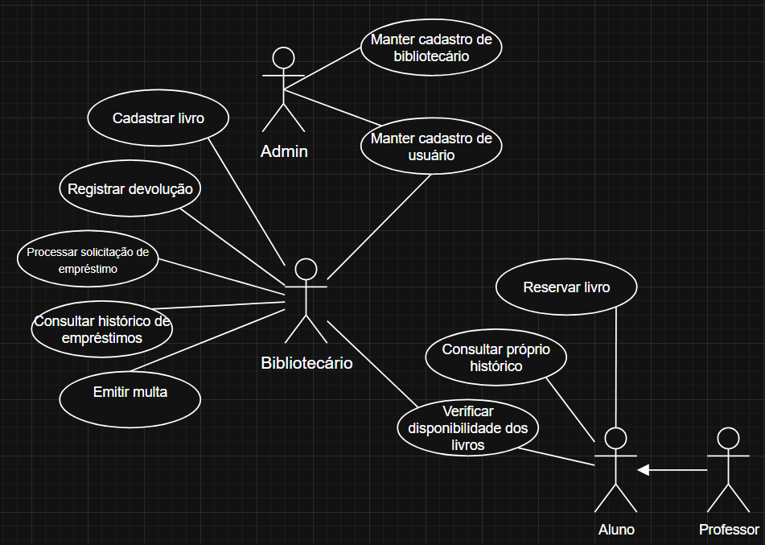

# 📚 Casos de Uso

## Casos de uso:

- CDU001 - Cadastrar livro (Bibliotecário)

- CDU002 - Cadastrar usuário (Bibliotecário)

- CDU003 - Realizar empréstimo (Bibliotecário)

- CDU004 - Registrar devolução (Bibliotecário)

- CDU005 - Consultar próprio histórico (Aluno/Professor)

- CDU006 - Reservar livro (Aluno/Professor)

- CDU007 - Consultar histórico de empréstimos (Bibliotecário)

- CDU008 - Emitir multa (Bibliotecário)

- CDU009 - Verificar disponibilidade dos livros (Bibliotecário)

# Casos de uso detalhados:
[CDU001 - Cadastrar livro](CDU001/especificacao.md)

[CDU002 - Cadastrar usuário](CDU002/especificacao.md)

[CDU003 - Processar solicitação de empréstimo](CDU003/especificacao.md)

[CDU004 - Registrar devolução](CDU004/especificacao.md)

[CDU005 - Consultar próprio histórico](CDU005/especificacao.md)

[CDU006 - Reservar livro](CDU006/especificacao.md)

[CDU007 - Consultar histórico de empréstimos](CDU007/especificacao.md)

[CDU008 - Emitir multa](CDU008/especificacao.md)

[CDU009 - Verificar disponibilidade dos livros](CDU009/especificacao.md)