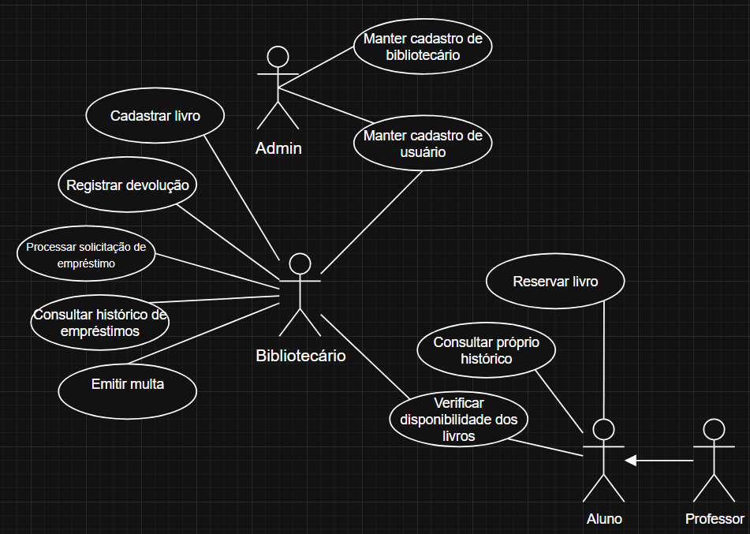

# 📚 Casos de Uso

## Casos de uso:

- CDU001 - Cadastrar livro

- CDU002 - Cadastrar usuário

- CDU003 - Realizar empréstimo (Bibliotecário)

- CDU004 - Registrar devolução

- CDU005 - Renovar empréstimo (Bibliotecário)

- CDU006 - Reservar livro (Aluno/Professor)

- CDU007 - Consultar histórico de empréstimos dos usuários (Bibliotecário)

- CDU008 - Emitir multa

- CDU009 - Verificar disponibilidade dos livros

# Exemplos de fluxo de casos de uso:

## Caso 1 – Cadastrar Livro
**Atores envolvidos:** Bibliotecário  

**Fluxo principal de eventos:**
1. [IN] Bibliotecário clica em “adicionar livro”  
2. [OUT] Sistema mostra a tela de cadastro  
3. [IN] Bibliotecário insere os dados do livro (nome, autor, código, capa)  
4. [IN] Bibliotecário aciona função “finalizar cadastro”  
5. [OUT] Sistema adiciona o livro ao banco de dados  

**Fluxos alternativos:** Nenhum  

**Pré-condições:**  
- Usuário deve estar logado como “Bibliotecário” no sistema  

**Pós-condições:**  
- O livro deve estar no banco de dados da biblioteca com todos os seus dados  

---

## Caso 2 – Realizar Empréstimo
**Atores envolvidos:** Bibliotecário, Aluno  

**Fluxo principal de eventos:**
1. [IN] Bibliotecário entra na seção “solicitações”  
2. [IN] Bibliotecário aciona a função “verificar disponibilidade”  
3. [OUT] Sistema mostra se o livro está disponível  
4. [IN] Bibliotecário permite o empréstimo  
5. [OUT] Sistema registra um exemplar como “emprestado” durante o período informado pela solicitação  

**Fluxo alternativo:**
1. [IN] Bibliotecário entra na seção “solicitações”  
2. [IN] Bibliotecário aciona a função “verificar disponibilidade”  
3. [OUT] Sistema mostra se o livro está disponível  
4. [IN] Bibliotecário não permite o empréstimo  
5. [OUT] Sistema informa o remetente da solicitação que ela foi negada  

**Pré-condições:**  
- Usuário deve estar logado como “Bibliotecário”  
- Ao menos uma solicitação deve ter sido enviada  

**Pós-condições:**  
- A solicitação deve ter sido processada como permitida ou negada  

---

## Caso 3 – Registrar Devolução
**Atores envolvidos:** Bibliotecário  

**Fluxo principal de eventos:**
1. [IN] Bibliotecário insere a matrícula do aluno  
2. [OUT] Sistema mostra os livros que aquele aluno tem emprestado e seu histórico de empréstimos  
3. [IN] Bibliotecário seleciona o livro cujo exemplar foi devolvido  
4. [IN] Bibliotecário marca o exemplar como devolvido  
5. [OUT] Sistema registra o exemplar como disponível novamente  

**Fluxos alternativos:** Nenhum  

**Pré-condições:**  
- Usuário deve estar logado como “Bibliotecário” no sistema  
- Ao menos um livro deve estar emprestado a algum aluno  

**Pós-condições:**  
- O exemplar deve estar como disponível no sistema  