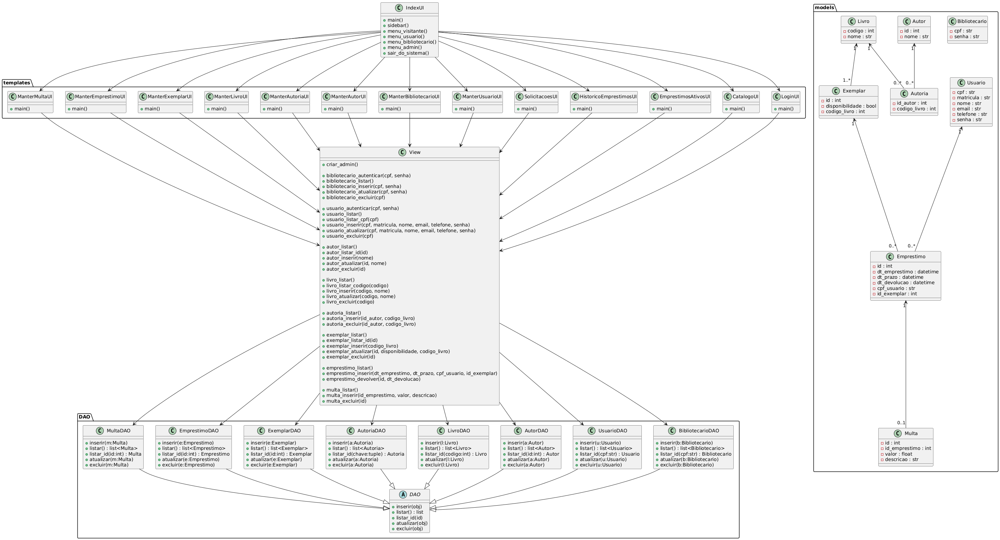

# 📘 Bibliotech

Documentação do projeto desenvolvido como atividade interdisciplinar – IFRN Campus Natal-Central.

---

## 1. Nome do Produto
**Bibliotech**

---

## 2. Descrição do problema

**Problema**: Método manual de gerenciamento de biblioteca é lento e obsoleto
**Afeta**: Professores, alunos e bibliotecários
**Impacto**: Lentidão e sobrecarga de logística
**Solução**: Implementar um sistema digital rápido e eficiente para o gerenciamento da biblioteca

**Método atual**
- Totalmente manual, usa-se documentos de responsabilidade e pastas físicas para armazená-lo.
- Com o sistem pronto, o tempo de tarefa será otimizado, tendo em vista que o aluno ou professor terá acesso a um catálogo digital, fará seu cadastro digitalmente e o registro será enviado diretamente para a área do bibliotecário, o qual homologará o empréstimo do livro.

**Em geral**:
O projeto visa substituir o método manual e obsoleto de gerenciamento de biblioteca por um sistema que gerencie todo o fluxo de livros da biblioteca, facilitando:
- A verificação de livros disponíveis
- O controle de empréstimos realizados e seus respectivos responsáveis
- A identificação de devoluções atrasadas

---

## 3. Descrição dos usuários

Os principais **stakeholders** do projeto são os membros das instituições que fazem uso da biblioteca e desejam otimizar o processo de empréstimo de livros. 

**Público-Alvo**
- Professores  
- Alunos  
- Bibliotecários  

**Professor/Aluno:**
- Visualiza catálogo de livros
- Solicita empréstimo de exemplares

**Bibliotecário:**
- Cadastra usuários
- Autoriza empréstimos
- Registra devoluções

---

## 4. Restrições e Premissas
- O sistema poderá ser acessado em computadores da biblioteca e da administração da instituição  
- O sistema só poderá ser acessado com conexão à internet  
- O banco de dados do sistema usará SQLite
- O sistema será desenvolvido em Python, com o framework Streamlit
- A arquitetura do sistema será no modelo MVT (Model, View, Template)

---
## Requisitos funcionais

|código| Nome                          | Descrição                                      | Categoria    | Classificação |
|------|-------------------------------|------------------------------------------------|--------------|---------------|
|RF001 | Cadastro de Usuário           | O sistema deve permitir o cadastro de novos usuários (Alunos, professores e funcionários). | Funcional    | Obrigatório   |
|RF002 | Login e Autenticação          | O sistema deve permitir login por CPF e senha. | Funcional    | Obrigatório   |
|RF003 | Cadastro de Livros            | O sistema deve permitir que o usuário cadastre o livro escolhido, inserindo nome e código do livro. | Funcional | Importante |
|RF004 | Reserva de Livros             | O sistema deve permitir que o usuário reserve o livro de seu interesse por um tempo determinado. | Funcional | Importante |
|RF005 | Registro de Devolução de Livros | O sistema deve registrar se o livro foi devolvido dentro ou fora do prazo e marcá-lo como disponível novamente. | Funcional | Obrigatório |
|RF006 | Renovação de Empréstimos      | O sistema deve permitir que o usuário renove o período de empréstimo, adicionando um novo prazo. | Funcional | Importante |
|RF007 | Notificação de Multa          | O sistema deve alertar o usuário quando o prazo do empréstimo estiver próximo, avisando sobre possível multa. | Funcional | Importante |
|RF008 | Controle do Estoque de Livros | O sistema deve disponibilizar um catálogo de livros e mostrar o estoque disponível. | Funcional | Obrigatório |
|RF009 | Consulta de Histórico         | O sistema deve registrar o histórico do usuário: livros emprestados, datas de empréstimo, datas de devolução e multas. | Funcional | Importante |

---
## Requisitos não-funcionais

|código| Nome                          | Descrição                                      | Categoria    | Classificação |
|------|-------------------------------|------------------------------------------------|--------------|---------------|
|NF001 | Controle de acesso do usuário | Somente usuários autenticados da instituição podem fazer acesso ao sistema                  | Segurança    | Obrigatório   |
|NF002 | Disponibilidade do sistema    | O sistema deve estar sempre disponível para os usuários, exceto em janelas de manutenção   | Confiabilidade | Importante |
|NF003 | Envio de avisos               | Todo dia anterior à devolução do livro, o sistema deve enviar um email para o aluno      | Facilidades de uso | Importante |
|NF004 | Impressão em PDF              | A multa pode ser impressa em pdf                                               | Facilidades de uso | Opcional |
|NF005 | Registro de ações             | O sistema deve registrar todas as ações cruciais do usuário, incluindo login e alterações de dados | Segurança | Obrigatório |
---
## 📚 Casos de Uso

**Os principais casos de uso identificados são:**

- Cadastrar livro
- CRUD de usuário
- Realizar empréstimo (Bibliotecário)
- Registrar devolução
- Renovar empréstimo (Bibliotecário)
- Reservar livro (Aluno/Professor)
- Consultar histórico de empréstimos dos usuários (Bibliotecário)
- Emitir multa
- Verificar disponibilidade dos livros

**Para mais detalhes, acesse o arquivo casos-de-uso.md**

[Casos de Uso](../casos-de-uso/casos-de-uso.md)

---

## 🧠 Diagrama de Classes de Análise

**Diagrama de classes de modelo/persistência**

---

## 🛠️ Tecnologias Utilizadas
- Diagramas elaborados com planttext.com e draw.io
- Documentação em Markdown
- Repositório hospedado no GitHub

---

## 👨‍💻 Equipe
| Nome                            | Matrícula      |
|---------------------------------|----------------|
| Vinícius Cavalcanti de Moura    | 20241011110017 |
| Thiago Tenório de Souza         | 20241011110006 |
| João Augusto Cruz de Medeiros   | 20241011110020 |

---