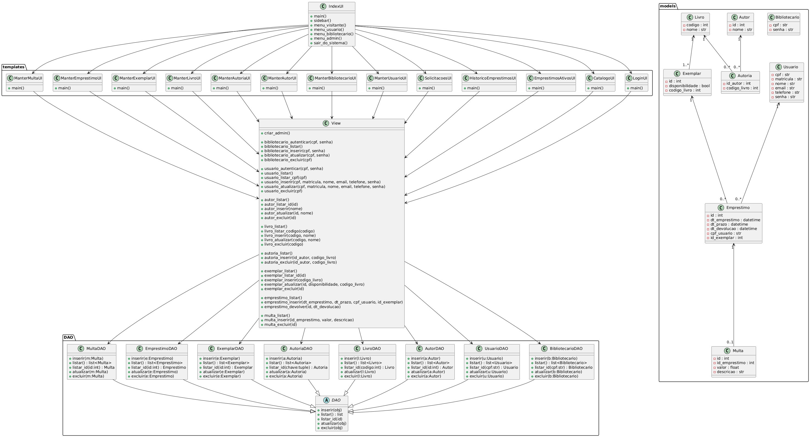

# 📘 Bibliotech

Documentação do projeto desenvolvido como atividade interdisciplinar – IFRN Campus Natal-Central.

---

## 1. Nome do Produto
**Bibliotech**

---

## 2. Descrição do problema

**Problema**: Método manual de gerenciamento de biblioteca é lento e obsoleto
**Afeta**: Professores, alunos e bibliotecários
**Impacto**: Lentidão e sobrecarga de logística
**Solução**: Implementar um sistema digital rápido e eficiente para o gerenciamento da biblioteca

**Método atual**
- Totalmente manual, usa-se documentos de responsabilidade e pastas físicas para armazená-lo.
- Com o sistem pronto, o tempo de tarefa será otimizado, tendo em vista que o aluno ou professor terá acesso a um catálogo digital, fará seu cadastro digitalmente e o registro será enviado diretamente para a área do bibliotecário, o qual homologará o empréstimo do livro.

**Em geral**:
O projeto visa substituir o método manual e obsoleto de gerenciamento de biblioteca por um sistema que gerencie todo o fluxo de livros da biblioteca, facilitando:
- A verificação de livros disponíveis
- O controle de empréstimos realizados e seus respectivos responsáveis
- A identificação de devoluções atrasadas

---

## 3. Descrição dos usuários

Os principais **stakeholders** do projeto são os membros das instituições que fazem uso da biblioteca e desejam otimizar o processo de empréstimo de livros. 

**Público-Alvo**
- Professores  
- Alunos  
- Bibliotecários  

**Professor/Aluno:**
- Visualiza catálogo de livros
- Solicita empréstimo de exemplares

**Bibliotecário:**
- Cadastra usuários
- Autoriza empréstimos
- Registra devoluções

---

## 4. Restrições e Premissas
- O sistema poderá ser acessado em computadores da biblioteca e da administração da instituição  
- O sistema só poderá ser acessado com conexão à internet  
- O banco de dados do sistema usará SQLite
- O sistema será desenvolvido em Python, com o framework Streamlit
- A arquitetura do sistema será no modelo MVT (Model, View, Template)

---

| código     | Nome      | Descrição    | Categoria    | Classificação |
|------------|-----------|--------------|--------------|---------------|
| NF001      | 20241011110017 |
|---------------------------------|----------------|
| NF002      | 20241011110006 |
|---------------------------------|----------------|
| NF003      | 20241011110020 |
|---------------------------------|----------------|
| NF004      | 20241011110017 |
|---------------------------------|----------------|
| NF005      | 20241011110006 |
|---------------------------------|----------------|
| NF006      | 20241011110020 |
|---------------------------------|----------------|

---
## 📚 Casos de Uso

**Os principais casos de uso identificados são:**

- Cadastrar livro
- CRUD de usuário
- Realizar empréstimo (Bibliotecário)
- Registrar devolução
- Renovar empréstimo (Bibliotecário)
- Reservar livro (Aluno/Professor)
- Consultar histórico de empréstimos dos usuários (Bibliotecário)
- Emitir multa
- Verificar disponibilidade dos livros

**Para mais detalhes, acesse o arquivo casos-de-uso.md**

[Casos de Uso](../casos-de-uso/casos-de-uso.md)

---

## 🧠 Diagrama de Classes de Análise

**Diagrama de classes de modelo/persistência**

---

## 🛠️ Tecnologias Utilizadas
- Diagramas elaborados com planttext.com e draw.io
- Documentação em Markdown
- Repositório hospedado no GitHub

---

## 👨‍💻 Equipe
| Nome                            | Matrícula      |
|---------------------------------|----------------|
| Vinícius Cavalcanti de Moura    | 20241011110017 |
|---------------------------------|----------------|
| Thiago Tenório de Souza         | 20241011110006 |
|---------------------------------|----------------|
| João Augusto Cruz de Medeiros   | 20241011110020 |
|---------------------------------|----------------|

---